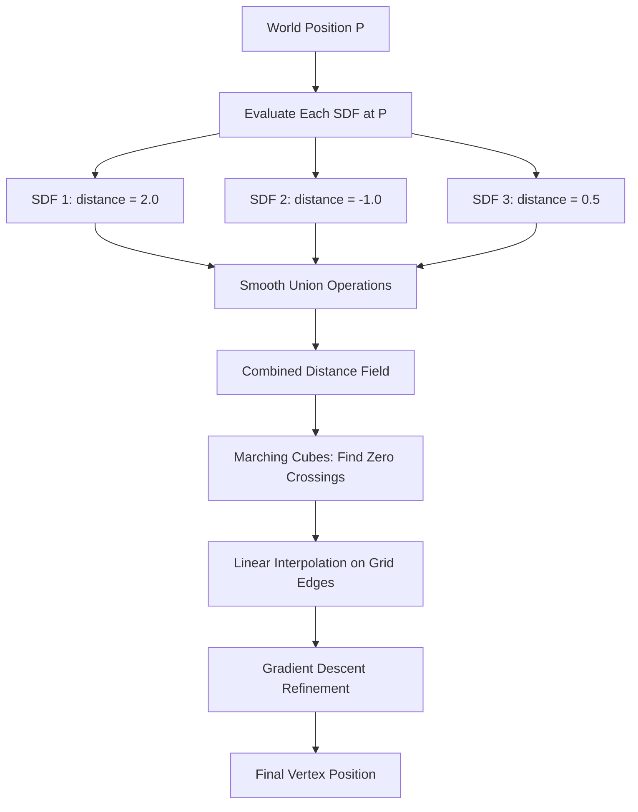

# SDF Vertex Position Resolution: How Multiple SDFs Determine Vertex Positions

## 🎯 The Question
**"What decides the vertex position when it's within the range of multiple SDFs?"**

## 📍 Quick Answer
When a vertex position is within range of multiple SDFs, the final position is determined by a **3-step hierarchical process**:
1. **SDF Distance Combination** - All SDF distances are mathematically blended
2. **Marching Cubes Surface Detection** - Zero-crossing points are found on grid edges  
3. **Linear Interpolation + Gradient Descent** - Exact vertex position is calculated

---

## 🔗 Key Implementation Files

| Component | File Path | Lines |
|-----------|-----------|-------|
| **SDF Combination Logic** | `SDFGeneration/Source/HLSL/MapSignedDistanceField.hlsl` | 389-417 |
| **Smooth Operations** | `SDFGeneration/Source/HLSL/SDFFunctions.hlsl` | 253-325 |
| **Vertex Interpolation** | `SDFGeneration/Source/HLSL/Resources/Compute_IsoSurfaceExtraction.compute` | 140-160, 270-285 |

---

## 🧮 The Mathematics

### Step 1: SDF Distance Combination

```hlsl
// From MapSignedDistanceField.hlsl:389-417
float Map(float3 p)
{
    float minDist = 10000000.0;  // Start with infinity
    
    [fastopt]
    for (int i = 0; i < _SDFDataCount; i++)
    {
        SDFGPUData data = _SDFData[i];
        SDFMaterialGPU material = _SDFMaterials[i];
        
        if (data.Operation == 0)      // UNION
            minDist = sdf_op_smin(sdf_with_noise(p, data, material), minDist, data.Smoothing);
        else if (data.Operation == 1) // SUBTRACTION  
            minDist = sdf_op_smoothSubtraction(sdf_with_noise(p, data, material), minDist, data.Smoothing);
        else                          // INTERSECTION
            minDist = sdf_op_smoothIntersection(sdf_with_noise(p, data, material), minDist, data.Smoothing);
    }
    
    return minDist;  // Final combined distance at point p
}
```

### Step 2: Smooth Union (Core Blending Formula)

```hlsl
// From SDFFunctions.hlsl:253-257 - THE CORE FORMULA!
float sdf_op_smin(float a, float b, float k)
{
    float h = max(k - abs(a - b), 0.0) / k;
    return min(a, b) - h * h * k * (1.0 / 4.0);
}
```

**Parameters:**
- **`a`** = distance from first SDF
- **`b`** = distance from accumulated previous SDFs  
- **`k`** = smoothing factor (controls blending amount)
- **`h`** = blend weight (0 to 1 based on distance difference)

**Mathematical Behavior:**
```
When SDF_A.distance = 2.0 and SDF_B.distance = -1.0:

If k = 0.5 (tight blending): 
    h = max(0.5 - 3.0, 0.0) / 0.5 = 0
    result = min(2.0, -1.0) = -1.0

If k = 5.0 (loose blending): 
    h = max(5.0 - 3.0, 0.0) / 5.0 = 0.4
    result = -1.0 - 0.4² × 5.0 × 0.25 = -1.2
```

### Step 3: Surface Point Interpolation

```hlsl
// From Compute_IsoSurfaceExtraction.compute:140-160
bool TryGetEdgeSurfaceIntersection(float sample_from, float sample_to, 
    float3 localPoint_from, float3 localPoint_to, float3 localOrigin, 
    out float3 localIntersectionPoint)
{
    if (sign(sample_to) == sign(sample_from))
        return false;  // No surface crossing
    
    // LINEAR INTERPOLATION - The moment of truth!
    float t = sample_from / (sample_from - sample_to);
    localIntersectionPoint = lerp(localPoint_from, localPoint_to, t);
    
    return true;
}
```

### Step 4: Gradient Descent Refinement

```hlsl
// From Compute_IsoSurfaceExtraction.compute:277-279
for (int l = 0; l < _GradientDescentIterations; l++)
{
    surfacePoint -= (MapNormal(surfacePoint, epsilon) * Map(surfacePoint));
}
```

---

## 💡 Simplified Process Flow



---

## 🎯 Key Insights

### How Overlapping SDFs Resolve:

1. **Distance Accumulation**: Each SDF at position `p` returns its signed distance
2. **Smooth Blending**: Distances are combined using polynomial smooth min/max operations  
3. **Zero-Crossing Detection**: Marching cubes finds where the combined distance field = 0
4. **Linear Interpolation**: Vertex placed between grid points based on distance ratio
5. **Gradient Refinement**: Position is iteratively adjusted toward the exact zero-distance surface

### The Influence Hierarchy:

- **Negative distances** (inside surfaces) have **stronger influence**
- **Smaller absolute distances** dominate the blending
- **Smoothing factor `k`** controls how much SDFs blend vs. hard-transition
- **All overlapping SDFs contribute** - no single SDF "wins", they mathematically blend

---

## 🔬 Pseudo Code Implementation

```pseudocode
function GetVertexPosition(worldPosition):
    // 1. Evaluate all SDFs at this position
    combinedDistance = +infinity
    
    for each SDF in scene:
        sdfDistance = SDF.evaluate(worldPosition)
        
        switch SDF.operation:
            case UNION:
                combinedDistance = smoothMin(combinedDistance, sdfDistance, SDF.smoothing)
            case SUBTRACT:
                combinedDistance = smoothSubtract(sdfDistance, combinedDistance, SDF.smoothing)
            case INTERSECT:
                combinedDistance = smoothIntersect(sdfDistance, combinedDistance, SDF.smoothing)
    
    // 2. Marching cubes finds surface crossing
    if signChange detected on grid edge:
        interpolationRatio = sample_from / (sample_from - sample_to)
        surfacePosition = lerp(edgeStart, edgeEnd, interpolationRatio)
        
        // 3. Gradient descent refinement
        for refinementIterations:
            surfacePosition -= gradient(surfacePosition) * distance(surfacePosition)
    
    return surfacePosition
```

---

## 🚀 The Bottom Line

**When multiple SDFs overlap, the vertex position is determined by:**

1. **🔢 Mathematical blending** of distance fields using smooth min/max operations
2. **📐 Linear interpolation** along grid edges where the combined surface crosses zero  
3. **🎯 Gradient descent** refinement for sub-voxel accuracy

**The "strongest" SDF (closest to zero distance) has the most influence, but ALL overlapping SDFs contribute to the final position through smooth polynomial blending.**

**This system uses smooth operations rather than hard Boolean logic, creating beautiful, organic blending between objects!** 🎨✨

---

## 📚 Additional Resources

- **Smooth SDF Operations**: [Inigo Quilez - SDF Functions](https://iquilezles.org/articles/distfunctions/)
- **Marching Cubes**: Classic isosurface extraction algorithm
- **Dual Contouring**: Alternative surface extraction (also implemented in this system)
- **Surface Nets**: Another surface extraction approach mentioned in comments

---

*Generated from deep codebase analysis of IsoMesh SDF system*
